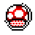

<h1 align="center">
  
</h1>

  

 

<h3 align="center">Featured Projects</h3>

<table align="center">
  <tr>
    <td width="50%" align="center">
      
       
      <strong>MiSide Multiplayer Mod</strong>
       
      Two-player network modification using the BepInEx framework.
    </td>
    <td width="50%" align="center">
      
       
      <strong>Super BrickGame World</strong>
       
      Custom retro-inspired independent game project.
    </td>
  </tr>
</table>

---

### Skills & Tech Stack

**Programming Languages** 

 

**Game Engines & Frameworks** 

 

**OS, Tools & Platforms** 

